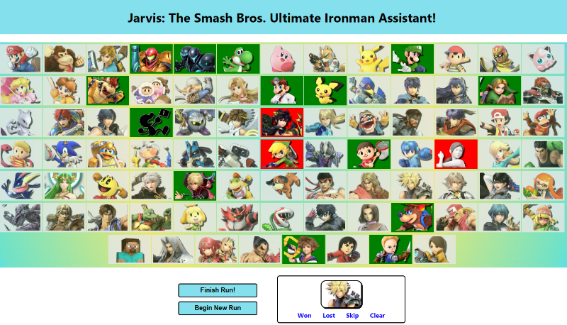

# Jarvis — The Smash Bros. Ultimate Companion App

Welcome to Jarvis, a companion app for Super Smash Bros. Ultimate ironman challenges! This is a WIP project at MVP status, with lots of room for upscaling.

## Description
In an Ironman attempt, a player tries to win a game of Smash Bros. with each character in the roster. Generally, players start with the first character in the roster (Mario), and move through each character in order. Jarvis is meant to help players with these challenges, so that they can easily track their progress starting anywhere, or even go through the cast randomly, so that they can have a more varied and entertaining experience.

[GitHub Repository](https://github.com/the-wake/jarvis-smash-companion)

## Installation
No installation is needed. The application front-end is run through GitHub Pages using React's GH Pages deployment.

## Functionality
Users are presented with images relating to each character in the game's roster, in roster order, in a neutral state. Clicking on a character toggles its status between won, lost, and unplayed, updating the state of the parent component. As players win or lose games, they can mark the state of the character.

A button along the bottom of the roster can be used to select randomly from the list of unplayed characters. This also generates buttons to mark that character as won, lost, or unplayed (rather than having to find them in the full roster component).

At any time, a user can click a button to end the run, clearing the data, or finish the run, which will lock the results and run analytics on the results. After finishing a run, changing the state of a character will prompt the user to clear the data first and start a new run.

All results are stored in local storage whenever a state is changed, loaded whenever the page is initialized, and cleared when a new run begins.

## Tools Used
* JavaScript
* Node
* NPM
* React
* GitHub
* GitBash
* Coded in VS Code

## Future Updates 
This project would be easy to upscale in a number of ways.

First, it could be expanded to have features for a wider range of challenges and styles of play. In particular, streamers (players who share their gameplay with others to watch over platforms such as twitch.tv) often do many types of challenges, so that would be a good place to start.

Second, the application could be integrated with a full MERN stack (or the database of choice) to store run histories. In addition to simply letting users view their old runs, this would provide lots of opportunities to provide helpful analytics. Questions like "How far does your average run go?", "Who do you win / lose with the most often", etc. would provide a lot of value to the end user.
